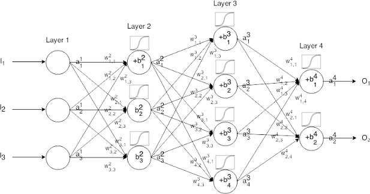
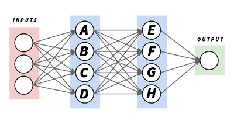
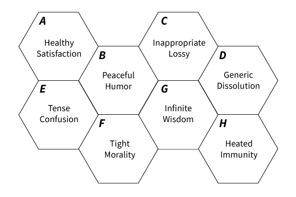
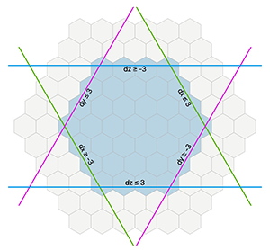
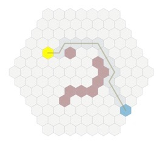
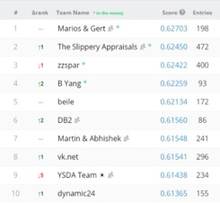

# APEX
“A lack of transparency results in distrust and a deep sense of insecurity” - Dalai Lama

_Abstract: The promise of AI is a brighter tomorrow, however It is deeply troubling that many AI systems created, such as Google’s deep mind, have shown signs of evolution beyond human comprehension.  These systems may be valuable for a stated purpose, but for the purpose of General AI, we should not create machines that rapidly eclipse our level of knowledge._

_APEX creates (human understandable) real world connections to decentralized systems.  The APEX Protocol is an extension to smart contracts that allows for data and actor introspection.  Learned data is stored and analyzed in a queryable, open-source knowledge base accessible by AIT’s (Artificial Intelligence Tokens)._

_The benefits of AI can immediately be applied to face the challenges decentralized applications (Dapps) face in three ways.  First, discovery of services and effectiveness of services rendered.  APEX has developed open-source protocols that enable the discovery & inter-operability between smart contracts.  Second, APEX combines introspection and data clustering to do predictive placement analysis and optionally self-executing discovery.  Third, the APEX vision is to connect smart contracts to the real world and through human understandable connections.  The APEX Influencer Marketplace (AIX) implements APEX protocols and forms the foundation for a transparent and human friendly General AI._

This whitepaper assumes a basic knowledge of blockchain, cryptocurrency, artificial intelligence including subsets of AI such as NLP, machine-learning and deep-learning.  Areas marked with _Advanced!_ will go into far greater detail.

## Background
Just around the time the internet was picking up steam a person by the name of Nick Szabo had an idea for a computer based, self-executing legal document — a Smart Contract. [Smart Contracts](https://en.wikipedia.org/wiki/Smart_contract) are a set of promises, specified in digital form, that include protocols within which parties perform on these promises [[1]](https://en.wikipedia.org/wiki/Smart_contract#cite_note-:2-1) 

In 2009 an unknown person going by the alias Satoshi Nakamoto created Bitcoin.  A digital ledger of sorts that’s primary use is to transfer value.  Using peer to peer networks (similar to torrents that powered the once popular Napster) the genius is it’s simplicity.  There’s no governing agency — the only basis for it’s value is implicit scarcity created through a mathematical formula.

[Ethereum](https://github.com/ethereum/wiki/wiki/White-Paper) is a combination of blockchain and smart contracts.  A self-executing set of decentralized systems designed to transfer value from one party to another given a set of conditions (transfer X from party A to party B when XYZ). 

Ethereum and future platforms such as EOS uses a form of  [distributed consensus](https://en.wikipedia.org/wiki/Consensus_(computer_science)) that will propel nascent systems to evolve at an exponential pace.   Ethereum’s founder  [Vitalik Buteri](https://techcrunch.com/2017/09/18/ethereum-will-replace-visa-in-a-couple-of-years-says-founder/) says "Ethereum will match Visa in scale in a couple of years".

## APEX connects the real world to smart contracts
APEX represents an evolution in the blockchain ecosystem whereby a present and evolving intelligence system will determine the best course for creation, distribution and optimization of dapps and dapp transactions.  

The APEX platform is a wrapper for blockchain based smart contracts on [Ethereum whitepaper](https://github.com/ethereum/wiki/wiki/White-Paper) and [EOS whitepaper](https://github.com/EOSIO/Documentation/blob/master/TechnicalWhitePaper.md).   APEX protocols extend smart contract functions to provide introspection for the purpose of providing a variety of AI functions by understanding the actors and consideration for transactions.  APEX systems provide a way to programmatically and visually query the raw database, learned clusters and predictive matching functions using AIT’s. 

With the introduction of AIX, APEX has taken an unprecedented step toward creating a human understandable General AI.   

## Human Understandable General AI
APEX is a three-part system.  A neural net paired and Monty Carlo simulation with output to a unique polygon clustering model where language is assigned and visualized.  

The difference between APEX and Google’s Deep Mind (a neural net - Monte Carlo simulation hybrid) is the output model to a multi-dimensional polygon architecture whereby associations are visualized and the distance between nodes is meaningful and easily understood.  

A complex neural network _Diagram A_ uses hidden layers to simulate connections between neurons in a human brain.  Increasing the number of layers leads to an exponentailly growing number of abstractions.  

_Diagram A_

It’s proven that General AI can be useful to draw conclusions & solve infinitely complex problems.  We want to introduce a system whereby language will explain said drawn conclusions method and teach us how the problem is being solved.  APEX contains a simulation engine connected to real-world human influence (AIX) to output a polygon based model that accurately assigns language to each connection. _Diagram B_ > _Diagram C_

_Diagram B_

_Diagram C_

The neural net assigns weight to each connection.  The resulting output assumes a cohesive distance based on this weight.  Using polymath we can evenly and accurately display the resulting connections. 

_Diagram D_

## AIX - The APEX Influencer Exchange
AIX is a full implementation of the APEX protocols.  AIX also creates the foundation for the language-base used to describe all the model clusters available throughout the APEX ecosystem.

The Apex Influencer Exchange (AIX) is a Dapp that allows for the conception and execution of influencer messaging programs, complete with establish fair & transparent value metrics that provide unbiased and comprehensive attribution.

AIX is queryable and accessible through web services in a variety of ways.  Specifically, you can purchase influence with AIT’s through a deep network of influencers in a broad array of categories. 

Purchasers and influencers have profiles that are ranked and scored.  

Influence is scored and weighted through short and long term effectiveness.

The resulting dataset powers the categorization of clusters from the APEX neural net.

## APEX Protocols
### send()
_An extension to send() on Ethereum_
**params:**
* to
* value
* to_whom
* from_whom
* for_what

## APEX AI
### Philosophy
It is our position that all AI systems should employ some form of empathy so they take into account the positive and potentially adverse effects of their actions.  An ancillary but important benefit of AIX will be to for Xepa to learn empathy.

### Modeling & Deep Learning

### Xepa - The Smart Contract AI

The APEX ecosystem for creating dapps is similar to Kaggle where the best algorithm will be introduced to solve a given problem.

Kaggle is a computer science simulator posing problems for computer scientists who’s algorithms are then scored to create a leaderboard.

Similar to Kaggle, APEX runs billions of deep-learning simulations for each submitted entry vs. our supervised model to whereby the winner’s model is injected for a given problem. 

In addition to protocols, the APEX AI known as Xepa uses NLP to provide common actions associated with dapps.

"Xepa, I'd like a create a contract for Katy Perry to offer merchandise to her fans." 
- Xepa replies "Great!, how many fans does Katy Perry have on Instagram?". 

"Xepa, I'd like to create a contract for my office to pool money for lunch."  
- Xepa replies - "Great, how many people are hungry and how much does everyone spend on lunch?"  

Eventually, Xepa could be used for transactions "Xepa, please send 20 BTC to Satoshi Nakamoto as a thank you for creating the blockchain."

# Actors (aid - APEX Identity)
Protocols can combine identities cross-sandbox through the use of a aid.  Specific identities can be useful when identifying identity groups, brands and tastemakers.  APEX will assign aid's to actors when available. 

Usually a protocol will reference an identity group.  The group has it's own unique AID.  Multiple AID's can be used as parameters without exception.  XEPA will define a subset of identity groups to start with.  [Identity Groups](https://www.doapex.com)

New actors can be added through the add_actor() protocol

# Consideration (aic - APEX Consideration)
Protocols will always have a reference to consideration.  Consideration is the actual item or service being exchanged for a token.  

Similar to identities, considerations can be grouped.  The group has it's own unique AIC.  Multiple AIC's can be used as parameters without exception.  XEPA will define a subset of consideration groups to start with.  [Consideration Groups](https://www.doapex.com)

New consideration can be added through the add_consideration() protocol

# Actual Value (aiv - APEX Value)
Protocols will contain references to an actual value for an item of consideration in any fiat or token currency.  The value at the time of a transaction will change overtime thus it's important to perform any fiat exchange operations and store them at the time of transaction.

Similar to identities, considerations can be grouped. Usually a protocol will reference an identity group.  The group has it's own unique AID.  Multiple AID's can be used as parameters without exception.  

New values can be added through the add_value() protocol

# APEX Overview
# Xepa - The smart contract bot
## Xepa Techniques
### NLP
Given specific inputs Xepa can perform basic actions.  Like most bots, Xepa will ask questions to fill in holes.

### Deep reinforcement learning

### Algorithm Injection
The APEX AI known as Xepa is a shell that accepts protocols injections from algorithm architects.  In laymans terms XEPA can be thought of as an algorythm choosing mechanism that is loosely coupled to the algorithm itself.  Any particular algorythm can be injected into any smart contract at the time of creation or later on.

### Model Determination
A contract model is a fully-formed set of protocol paramaters with a given orientation.  An algorithm match is made when an algorythm with a simulation score of 78 or better matches the input paramaters for a new smart contract.  A "parameter" match will always be selected before a "close" match because it's impossible to weight the missing paramater given a particual ecosystem.

### Model Evolution
A model may evolve over time and in a fashion similar to git-hub may be rolled backwards or forwards.  This is different than remodeling.  Remodeling occurs when a system consistently fails to uphold model standards or thresholds.

### Algorithm Architects
Architects are paid in AIT when their algorythms match a set of inputs to create a smart contract.  This "match" is the output of the algorithm in the form of a smart contract with accompanying protocols.

# Protocols
### create(name, sym, amount, for_what, for_whom)
Recommend smart contracts based on capital needs & market demand

'''
create({'actor':{'name':'Katy Perry', 'aid':'kDy4Yu7rBwhmWFpuk6CFBbjPjFa2', 'audience_size': 100000000, 'vibrancy':23, 'engagement':78}, 'consideration': 'Merchandise', 'volume': 200000, 'platform': 'Ethereum' })
'''

Output will result in a smart contract that implements the send() and redeem() protocols

### redeem()
Accept tokens in return for some consideration

# Protocol Parameters
All protocol parameters come in the form of an array

for_what: [aic] - Array of consideration and/or consideration group Id's
for_whom: [aid] - Array of actor and/or actor group Id's
to_whom: [aid] - Array of actor and/or actor group Id's
from_whom: [aid] - Array of actor and/or actor group Id's

# Roadmap
### Xepa Bot (web, ios, android)
### AIX (APEX influencer exchange)

## Stretch Goals
### 20m - Xepa Spoken Interface
Xepa will adopt the a spoken voice voice of a young british lady.
### 35m - APEX Marketplaces
APEX will open 3 marketplaces  
- Entertainment
- Travel & Recreation
- Virtual Goods
### 50m - APEX Exchange & Wallet
Xepa will become an exchange similar to coinbase with a spoken interface.  "Xepa, please send 10 Ether to John for lunch."
### 60m - VR & Augmented Reality Connectors
APEX will design a series of protocols to create smart contracts in VR.  
### 70m - Robotics Connectors
Xepa will gain the ability to natively communicate with popular robotics platforms.
### 80m - IoT connectors
Xepa will connect to your toaster and fridge.  "You may have your coffee when 75% of you are thirsty."
### 90m - Creativity Connectors
Xepa will get her groove on with vision, music, art and dance protocols.  You could organize a flash mob or a nationwide art project.
### 100m - APEX Marketplaces
APEX will open 5 more marketplaces  
- Finance
- Pharma
- AI
- Entertainment
- Jobs
### 150m - Real Estate
APEX will design a series of protocols for buying and transfering physical property.
### 250m - Distributed deep-learning computing platform (Ethereum for deep-learning)
We will build a blockchain where miners earn gas for performing deep-learning processes.

### References
1. Smart Contracts: Building Blocks for Digital Markets http://www.fon.hum.uva.nl/rob/Courses/InformationInSpeech/CDROM/Literature/LOTwinterschool2006/szabo.best.vwh.net/smart_contracts_2.html
2.
3.

